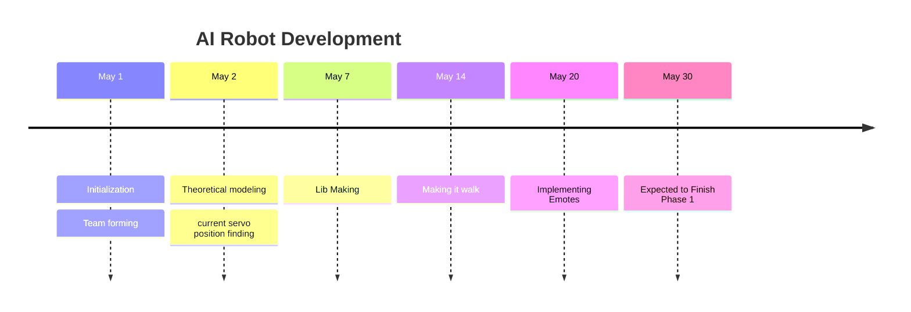

---
{"dg-publish":true,"permalink":"/02-projects/ai-robot/03-development/"}
---

# Development
Our main goal is to make the humanoid robot **walk** .   

 

- There are 17 servo motors in the humanoid robot. 
-  
## Timeline

## Tasks
 